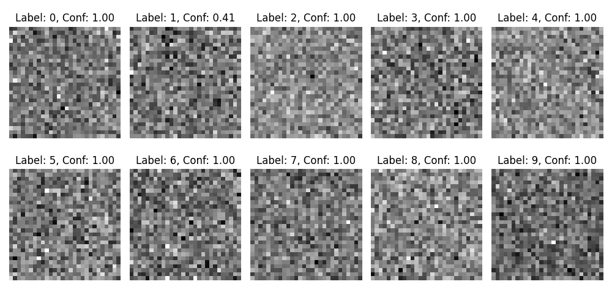

# Deceiving Neural Networks: A Case Study with MNIST

## Overview
This repository presents a compelling case study on the vulnerability of neural networks to targeted deceptions. By using a Convolutional Neural Network (CNN) trained on the MNIST dataset, I demonstrate how a well-trained model can be deceived into misclassifying manipulated input with high confidence.

## Objective
The primary goal of this project is to highlight the ease with which a sophisticated neural network can be tricked. This experiment involves two key phases:
1. **Training a CNN on MNIST:** First train a CNN on the MNIST dataset, a standard benchmark in machine learning for handwritten digit recognition.
2. **Deceptive Training (Adversarial Attack):** After the CNN is well-trained, I freeze its parameters, then craft a 'deceptive' image – visually unrecognizable or random gibberish – and train the network to classify this image as a specific digit (e.g., '5') with high confidence (0.99 probability).

## Methodology
- **CNN Architecture:** The model employs a robust architecture suitable for digit recognition, consisting of convolutional layers, max pooling, and fully connected layers. Possibly an overkill for MNIST, which makes it even better.
- **Adversarial Technique:** Then use an adversarial training approach where the input image is iteratively adjusted (using gradient descent just like model parameters), keeping the model parameters fixed, to maximize the likelihood of correct classification.

## Repository Contents
- `cnn_training.ipynb`: Jupyter notebook for training the CNN on MNIST.
- `deceive_mnist.ipynb`: Notebook demonstrating the process of crafting and training the deceptive image.
- `data/`: Holds the MNIST dataset
- `models/`: Directory containing the trained CNN model.
- `images/`: Sample outputs including the deceptive image and its classification result.

## Usage
Open the notebook, run the notebook, read the comments of the notebook...

## Results
The following images show the predicted label, and the confidence (from 0.00 to 1.00) of the model. To be clear, the model achieves a validation error of ~99.2% accuracy on the validation data.

## Implications
The results of this experiment are crucial for understanding the limitations and vulnerabilities of neural networks, especially in applications where security and reliability are important. It underscores the necessity for robust adversarial training and the development of models resilient to such deceptive practices.

## Followup
I also trained a new network with gibberish images so that it identifies random noise as it's own class, however, when new images are trained with the new network, they also looked nothing like what they are supposed to

Though it seems like some patterns are emerging, as unlike the last time, these don't look completely random. A further investigation would be repeating this process for multiple times, and see if we can basically generate handwritten digits by our method.
